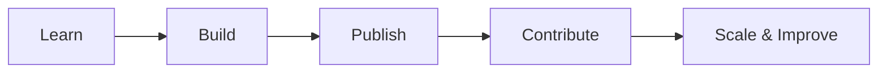

  

  # 🚀 CID-Cell
  
  **Department of Computer Science & Engineering, MITS Gwalior**  
  *Bridging the gap between academic learning and practical, real-world development.*

   

   
  
  
  

   

## 🌍 About Us

**CID-Cell (Collaborative Innovation & Development Cell)** is an open-source-driven innovation ecosystem developed by and for the students of **Madhav Institute of Technology & Science (MITS)**. Our primary goal is to transform students into skilled, real-world developers by placing them at the heart of meaningful, production-ready software systems.

We believe in doing rather than just studying. Here, students build, collaborate, and contribute—learning modern architectures, clean code principles, and large-scale teamwork along the way.

---

## 🎯 Our Mission

> To create a structured environment where students evolve from isolated learners to open-source contributors and industry-ready engineers through completely hands-on, collaborative development.

---

## 🧩 What We Do

### 🛠️ Project-Driven Development
We focus exclusively on building full-scale, real-world applications (Micro, Macro, and Capstone projects). We encourage problem-solving over passive learning.

### 🌐 Open Source Collaboration
Everything we build is developed in the open. Contributions, code reviews, and discussions are highly encouraged from students across all levels.

### 💬 Mentorship & Real-time Problem Solving
Our ecosystem connects **Students, Mentors, Faculty, and Admins**. Through features like **Doubt Sessions**, **Real-Time WebSockets Chat**, and **Project Roadmaps**, finding help and collaborating has never been easier.

---

## 💻 Tech Culture & Stack

Projects under this organization typically leverage the modern web ecosystem:
- **Frontend:** React 19, Vite, Tailwind CSS, Lucide Icons, Neo-Brutalist minimalist UI
- **Backend:** Node.js, Express.js, Socket.io (for real-time features)
- **Database & Storage:** MongoDB (Mongoose), Cloudinary 
- **Security & Quality:** JWT / Google Auth, Zod Validation, Helmet, Jest

---

## 🔁 The Lifecycle

1. **Learn** core concepts through structured guidance and mentor support.  
2. **Build** your projects within the CID-Cell environment.  
3. **Publish** them right here in this GitHub organization.  
4. **Open** them up for peer contributions.  
5. **Continuously improve** and scale for production.  

---

## 📂 Repository Structure

Projects in this organization are categorized based on their scope:

- 🟢 **Learning:** Foundational implementations & boilerplates
- 🔵 **Development:** Full-fledged features and web applications
- 🟣 **Advanced:** Highly scalable backend systems, Socket.io microservices, etc.
- 🟡 **Open Source:** Major collaborative initiatives open to the entire college

---

## 🚀 Getting Started

Want to contribute to the next big thing at MITS? Here's how:

1. **Explore:** Browse our pinned repositories below and find a project that excites you.
2. **Setup:** Read the project's `README.md` to run the frontend & backend locally.
3. **Contribute:** 
   - Fork the repository
   - Create a feature branch (`git checkout -b feature/amazing-feature`)
   - Make your changes and commit cleanly
   - Submit a Pull Request!
4. **Collaborate:** Participate in PR reviews, suggest ideas in the Issues tab, and iterate!

---

## 📜 Standard Guidelines

- Write clean, formatted, and maintainable code.
- Write meaningful, descriptive commit messages.
- Keep pull requests focused on a single issue or feature.
- Be respectful, helpful, and constructive in all code reviews.

---

  <h3>🤝 Join Us</h3>
  
Whether you're writing your first "Hello World" or architecting a distributed system, there's a place for you here. Let's build a culture of innovation and execution.

  
<b>Driven by students, for students. ❤️</b>

